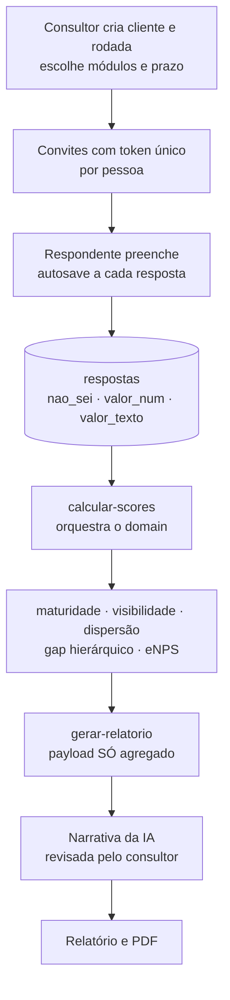

# Arquitetura — Diagnóstico 360

Documento derivado do `CLAUDE.md`. Nada aqui é decisão nova de produto: onde o
`CLAUDE.md` é a lei, este documento explica como ela se traduz em camadas, fluxo de
dados e limites técnicos. As poucas decisões tomadas na Sessão 1 que o `CLAUDE.md`
não cobria estão isoladas na seção **Decisões da Sessão 1**, e as que ficaram em
aberto estão em **Pendências de decisão** — por regra do projeto, elas não foram
resolvidas por conta própria.

---

## 1. O que o sistema é

Ferramenta de consultoria organizacional **multi-empresa**: o mesmo sistema atende
vários clientes de consultoria. Ela coleta a percepção de todas as pessoas de uma
empresa (sócios, gestores, colaboradores, terceirizados) sobre as áreas do negócio e
gera um relatório de diagnóstico consolidado.

O eixo que organiza a arquitetura inteira é o princípio central do produto: **"não
sei" não é nota baixa**. Uma resposta "não sei" nunca entra na média de maturidade;
ela alimenta uma métrica separada, o Índice de Visibilidade. Manter essas duas
grandezas separadas não é detalhe de cálculo — é a razão de existir da camada de
domínio isolada, da constraint no banco e da regra imposta à IA que redige o
relatório.

---

## 2. Camadas

O sistema tem quatro camadas, e a fronteira entre a terceira e a quarta é a que
sustenta a segurança do fluxo público.

**Apresentação** (`src/app/`, `src/responder/`, `src/components/`) — React 19 +
Vite. Renderiza e coleta; não decide regra de negócio. `src/app/` são as telas
protegidas do consultor, `src/responder/` é o fluxo público, e a separação entre as
duas é física justamente porque os caminhos de autenticação são diferentes.

**Domínio** (`src/domain/`) — funções puras, sem Supabase e sem React. Scoring,
elegibilidade e agregação moram aqui. É a camada mais importante para testes: sem
I/O, cada regra dura vira um teste determinístico que roda em milissegundos. Se uma
regra de cálculo precisar de rede para ser testada, ela está na camada errada.

**Acesso a dados** (`src/lib/`) — client Supabase, tipos gerados do schema, utils.
É o único lugar do frontend que sabe que existe um Supabase.

**Backend** (`supabase/`) — Postgres com RLS, Auth, e edge functions em Deno. As
edge functions previstas são `responder-inicio`, `responder-salvar`,
`responder-concluir`, `calcular-scores` e `gerar-relatorio`.

A dependência é sempre para dentro: apresentação conhece domínio, domínio não conhece
ninguém. `calcular-scores` **orquestra** e não contém regra — a regra fica no domain,
para que exista uma única definição de maturidade no sistema, testada uma vez só.

---

## 3. Os dois caminhos de acesso

São completamente separados, e é isso que permite ao respondente não ter login sem
que as tabelas de resposta fiquem expostas.

```mermaid
flowchart LR
  subgraph consultor["Consultor — autenticado"]
    C[Login e-mail/senha] --> CA["/app (rotas protegidas)"]
    CA --> CS[Supabase client<br/>anon key]
  end

  subgraph respondente["Respondente — sem login"]
    R["/responder/:token"] --> EF[Edge functions<br/>service role]
  end

  CS -->|RLS: owner_id = auth.uid&#40;&#41;| DB[(Postgres)]
  EF -->|valida o token<br/>antes de ler ou gravar| DB
```



**Consultor.** Login por e-mail/senha, painel em `/app`. O isolamento entre
consultores é responsabilidade do RLS, não do frontend: cada consultor só enxerga
registros que descendem de um cliente com `owner_id = auth.uid()`. Como a regra vive
no banco, ela vale igualmente para o app, para um script e para alguém com a anon key
na mão — por isso o critério de pronto da Fase 1 é um teste que prova que o consultor
A não lê os clientes do consultor B.

**Respondente.** Não faz login. Acessa por `/responder/:token`, e **o token é a
credencial**. Toda leitura e gravação passa por edge function com service role que
valida o token; as tabelas de resposta nunca são expostas ao client sem autenticação.
A consequência prática para quem implementa a Fase 4: o fluxo do respondente não usa
o client Supabase do frontend para nada — se aparecer um `supabase.from('respostas')`
em `src/responder/`, o modelo de segurança foi quebrado.

---

## 4. Fluxo de dados



Três pontos desse fluxo são onde o princípio do produto pode ser destruído por
descuido, e cada um tem uma defesa própria:

1. **Na gravação** — a constraint `chk_nao_sei` garante no banco que uma resposta
   marcada como "não sei" não carrega valor algum. Não dá para ter as duas coisas.
2. **No cálculo** — `nao_sei = true` entra na visibilidade e nunca na maturidade.
3. **Na redação** — a IA recebe apenas agregados e é obrigada a escrever "dado
   insuficiente" quando a cobertura é baixa, em vez de preencher a lacuna com
   suposição plausível.

---

## 5. Motor de cálculo

Vive em `src/domain/scoring.ts` como funções puras. A normalização de um item válido
(`nao_sei = false`) é `v = valor_num`, espelhado para `6 - v` quando a pergunta é
invertida, e então `score = ((v - 1) / 4) * 100`.

| Métrica | Definição |
| --- | --- |
| `maturidade` | `Σ(score × peso) / Σ(peso)` — somente respostas válidas |
| `visibilidade` | `respostas_validas / respostas_aplicaveis × 100` |
| `dispersao` | desvio-padrão dos scores |
| `gap_hierarquico` | `média(socio, gestor) − média(colaborador)` |
| `enps` | `%(9-10) − %(0-6)`, suprimido se `n < 5` |

As três regras duras, cada uma com teste próprio:

- `nao_sei = true` nunca entra na maturidade, só na visibilidade.
- `visibilidade < 40%` → `confiavel = false`, e **nenhuma** nota de maturidade é
  emitida, em tela alguma nem no PDF.
- Recorte com `n < 3` nunca é exibido — é o que sustenta a promessa de sigilo feita
  ao respondente na tela de abertura.

A última merece ênfase arquitetural: a supressão é uma promessa feita por escrito a
quem respondeu. Ela precisa ser aplicada no domain, e não em cada tela, porque uma
tela nova esquecida vira quebra de sigilo.

---

## 6. Elegibilidade e progresso

O roteamento condicional do formulário também é domínio puro
(`src/domain/elegibilidade.ts`, Fase 4): o bloco de área vem de `ID.04`, o bloco de
liderança só aparece se `ID.06 ∈ {socio, gestor}`, e os follow-ups (`D4.03`,
`COM.04`, `FIN.04`) só aparecem se a pergunta anterior foi positiva. O escopo vazio
significa "todos" — `area_scope = '{}'` aparece para todas as áreas.

Disso decorre uma regra de UI que é fácil errar: o progresso é calculado sobre as
perguntas **aplicáveis ao perfil**, nunca sobre o total. Um colaborador que não vê o
bloco de liderança não pode terminar o questionário em 70%.

---

## 7. Segurança e segredos

- `VITE_SUPABASE_URL` e `VITE_SUPABASE_ANON_KEY` são públicos e vão ao bundle. **Todo
  e qualquer** valor com prefixo `VITE_` é embutido no JavaScript servido ao
  navegador.
- `SUPABASE_SERVICE_ROLE_KEY` e chaves de IA ficam **apenas** nos secrets das edge
  functions. Nunca em `.env` versionado, nunca em código do frontend.
- A chamada ao modelo de IA acontece na edge function `gerar-relatorio`, nunca no
  browser — tanto pela chave quanto pelo próximo item.
- O payload enviado à IA contém **somente agregados**. Nunca resposta individual
  identificada, nunca nome próprio.
- Verificação de fumaça do checklist: `grep -r "service_role\|sk-\|anthropic" src/`
  não deve retornar nada.

---

## 8. Estrutura de pastas

```
src/
  app/            rotas e telas do consultor (protegidas)
  responder/      fluxo público do respondente
  components/     ui/ (shadcn) e compartilhados
  lib/            supabase client, tipos gerados, utils
  domain/         regras puras: scoring, elegibilidade, agregação — SEM I/O
  hooks/
supabase/
  migrations/
  functions/      responder-inicio, responder-salvar, responder-concluir,
                  calcular-scores, gerar-relatorio
docs/
e2e/              Playwright — caminho crítico (Fase 4)
```

---

## 9. Design como requisito técnico

O conceito é **blueprint** (planta técnica), e a justificativa é funcional, não
estética: se a ferramenta parecer amadora, as pessoas respondem de qualquer jeito e o
dado não presta.

Os tokens do `CLAUDE.md` estão em `src/index.css` como a fonte da verdade, e as
variáveis semânticas do shadcn são **derivadas** delas — não são duas paletas
convivendo. Estão expostos como utilitários Tailwind: `bg-critico`, `text-sem-dado`,
`bg-saudavel`, `text-atencao`, `bg-bg-dark`, `bg-bg-light`.

O token `--sem-dado` é cinza e nunca vermelho. Isso é coerência de produto, não
preferência visual: um relatório que pinta de vermelho aquilo que as pessoas não
sabem está dizendo que não saber é erro, exatamente o oposto do que a tela de abertura
promete ao respondente.

Utilitários de composição disponíveis: `.grade-blueprint` (grade de pontos a 32px),
`.numero-secao` (numeração grande a 5% de opacidade atrás do título) e
`.card-pergunta-ativo` (borda esquerda de 3px no acento dourado).

Proibido: azul genérico em botão, gradiente roxo-azul, card padrão com
`border-radius: 8px` + `box-shadow` default, ilustração de equipe sorrindo e emoji em
título.

---

## 10. Decisões da Sessão 1

Registradas porque não estavam no `CLAUDE.md` e foram necessárias para o setup
funcionar. Todas são reversíveis e nenhuma toca regra de produto.

| Decisão | Porquê |
| --- | --- |
| `--accent` do shadcn recebe o acento da marca | O `CLAUDE.md` define `--accent` como o acento; o shadcn usa o mesmo nome para "fundo sutil de hover". Manter os dois significaria duas cores com o mesmo nome. O token do `CLAUDE.md` venceu. `--accent-foreground` é o marinho (contraste ≈ 5,6:1 sobre o dourado). |
| Ação primária = marinho, não o dourado | O dourado é acento e foco; usá-lo no botão primário gastaria o destaque. **Confirmado na Fase 3**, junto com a troca da paleta para a identidade da Ethos Lab: marinho `#16324D` como dominante e dourado `#C8A951` como acento, mantendo a escala de diagnóstico (crítico/atenção/saudável/sem-dado) intacta — ela precisa ler como semáforo, não como marca. |
| `--radius: 0.25rem` | O `CLAUDE.md` proíbe o card genérico de 8px. Cantos quase retos são a leitura direta de "planta técnica". |
| Inter e Oswald via `@fontsource` | Fontes exigidas pelo `CLAUDE.md`. Auto-hospedadas em vez de Google Fonts: sem requisição a terceiro, sem variação de layout no carregamento. O `shadcn init` instalara Geist, que foi removida. |
| `strict: true` no TypeScript | O scaffold do Vite não o traz. Numa base cujo núcleo é cálculo numérico com campos anuláveis, `strict` é o que impede um `null` de virar `0` silenciosamente. |
| `react-router-dom` mantido na versão mais nova (7.18.2), **não** no que o `npm audit fix` sugere | O `npm audit` aponta GHSA-qwww-vcr4-c8h2 (`>=7.12.0 <8.3.0`) e propõe "corrigir" descendo para 7.11.0. Isso piora a segurança: a 7.11.0 cai na faixa `6.0.0 – 7.17.0`, afetada por open redirect e XSS em `<Link>`/`useNavigate` — falhas que atingem um SPA. A advisory restante é exclusiva do modo RSC, que este projeto não usa. **Não rodar `npm audit fix` nesta dependência.** Revisar quando sair correção na linha 7.x. |
| Escala 1.25x materializada em `--text-*` | O `CLAUDE.md` pede escala 1.25x; ela foi calculada a partir de 16px e sobrescreve a escala padrão do Tailwind, para que `text-xl` já signifique a escala do projeto. |

---

## 10b. Decisões da Fase 1

| Decisão | Porquê |
| --- | --- |
| Helpers `owns_cliente` / `owns_rodada` / `owns_respondente` em `security definer` | Uma política que consulta outra tabela protegida por RLS fica sujeita à RLS daquela tabela, o que gera recursão e políticas ilegíveis. Cada helper responde só um booleano sobre propriedade, com `search_path` fixo e `execute` revogado de `public`. |
| Enums de Postgres em vez de `CHECK` para `status`, `vinculo`, `bloco` e `tipo` | Os valores vêm enumerados no `CLAUDE.md` e são estáveis. O gerador de tipos os transforma em união literal no TypeScript, então o valor inválido morre em tempo de compilação. |
| `respostas` e `respondentes` sem policy de escrita para `authenticated` | Quem escreve é a edge function com service role, depois de validar o token. A ausência de policy é o mecanismo: RLS nega por padrão. O consultor lê para agregar e nunca edita a resposta de ninguém. |
| Teste de banco em SQL puro, rodado por `psql` | As regras testadas são do Postgres — RLS, GRANT, CHECK. Um cliente Node no meio só acrescentaria dependência e uma camada entre o teste e o que ele afirma. |
| Trigger `on_auth_user_created` | Sem ele o consultor autentica mas não tem linha em `profiles` para as políticas referenciarem. É plumbing do Supabase Auth, não campo novo. |
| `supabase` CLI como devDependency | É a ferramenta canônica para `gen types` e para as migrations; o bootstrap do projeto já previa `supabase init`. Os tipos passam a ser gerados do schema em vez de escritos à mão — escritos à mão, eles divergem em silêncio. |
| Guarda de rota é conveniência, não segurança | `RotaProtegida` existe para a pessoa ver o login em vez de um painel vazio. Quem protege o dado é a RLS. Vale registrar para que ninguém trate a guarda como controle de acesso. |
| Login com mensagem de erro única | Dizer qual dos dois campos está errado entrega a quem tenta adivinhar a informação de que o e-mail existe. Há teste garantindo que a mensagem do provedor não vaza para a tela. |

## 11. Pendências de decisão

Não decididas por conta própria, conforme a regra do projeto. Cada uma tem um momento
natural para ser resolvida.

1. **Modo escuro.** O `CLAUDE.md` especifica fundo claro e também um token
   `--bg-dark`. Existe um bloco `.dark` coerente no CSS, mas **nada no app o
   ativa** — não há toggle nem detecção de preferência. Definir na Fase 2 se o painel
   do consultor terá tema escuro ou se `--bg-dark` é só para superfícies (sidebar,
   cabeçalho).
2. **Cor do botão primário.** Ver a decisão acima; confirmar quando houver CTA real.
3. **Provedor de e-mail dos convites.** A Fase 2 gera token e link único por pessoa,
   e `convites` tem `enviado_em` e `lembretes_enviados`. Não está definido se o
   sistema dispara e-mail ou se o consultor leva o link para fora.
4. **Modelo de IA da Fase 6.** O prompt de sistema e a temperatura (0.3) estão
   definidos; o provedor e o modelo, não.
5. **Idioma da interface.** Tudo foi escrito em pt-BR (`<html lang="pt-BR">`). Não há
   requisito de i18n; confirmar que nunca haverá antes que isso fique caro.
6. **Quem edita o banco de perguntas.** `perguntas` é um catálogo global, não
   pertence a nenhum cliente. Na Fase 1 ficou com leitura para qualquer consultor
   autenticado e **escrita só para o service role**. A Fase 3 pede uma tela de gestão
   em `/app/perguntas`, e aí é preciso decidir: um consultor editando o catálogo
   altera o questionário de todos os outros. Opções: manter a edição fora do app,
   restringir por `profiles.role`, ou versionar o catálogo por rodada. Nada foi
   decidido — a policy de escrita simplesmente não existe até lá.
7. **Cadastro de consultores.** Só há login; não há tela de criação de conta. Definir
   se o consultor é criado à mão no painel do Supabase, por convite, ou por uma tela
   de cadastro (que precisaria de aprovação, já que `/app` é acesso restrito).
